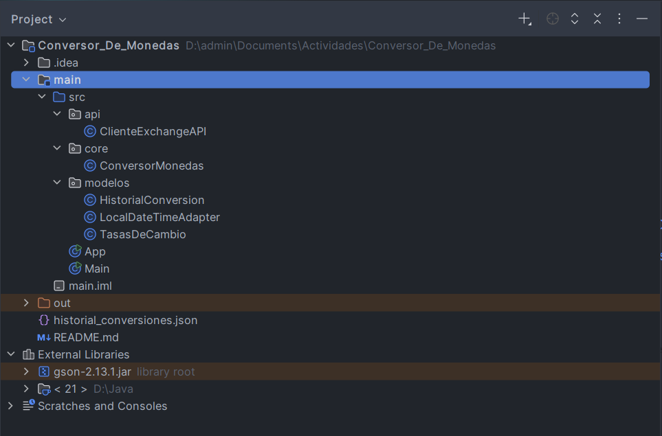
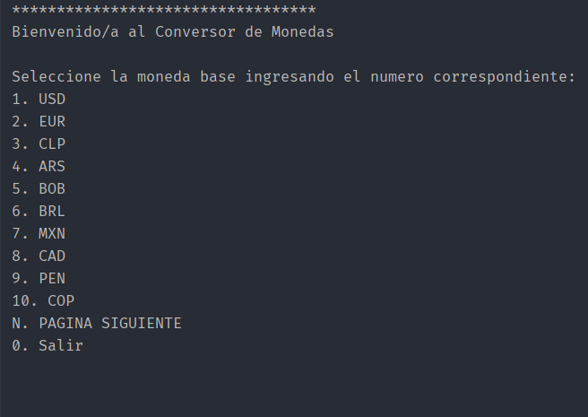
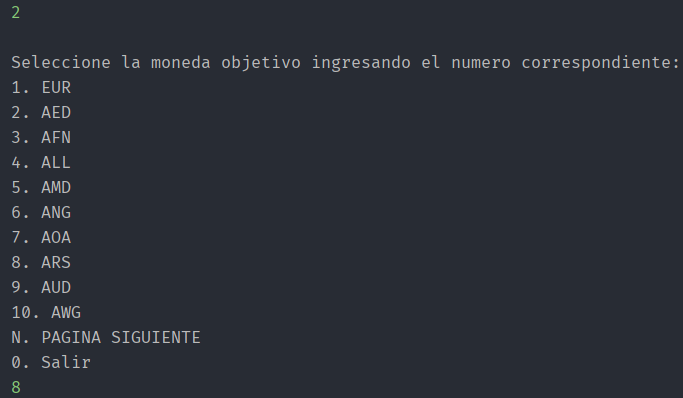
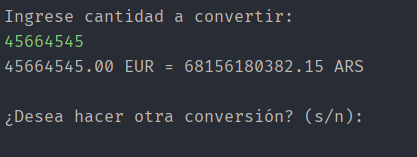
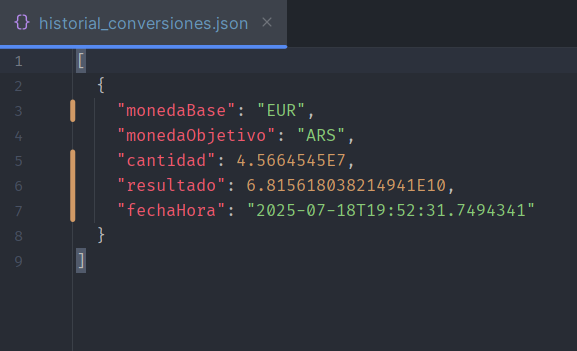

# Conversor De Monedas

Este proyecto es una aplicación de consola desarrollada en Java que perimite realizar conversiones entre distintas monedas utilizando una API de tasas de cambio en tiempo real. Fue creado como parte del programa **Oracle Next Education (ONE)** en colaboración con **Alura Latam**.

---

## Funcionalidades


- Conversión entre más de 20 monedas Américca y Europa.
- Menú interactivo con navegación paginada para elegir moneda base y destino.
- Validación de entrada del usuario.
- Historial de conversiones almacenado en formato JSON(`hitorial_conversiones.json`).
- Tasas de cambio en tiempo real obtenidas desde una API externa.

 ---

 ## Tegnologías utilizadas

- **Java 17+**
- **Gson** (Google) para manejo de archivos JSON.
- Programación de estructuras, paquetes y modelos.

 ---

## Estructura del Proyecto 




##  ¿Cómo ejecutar el proyecto?
1. **Clona este repositorio**

```bash
git clone http://github.com/MariaAcri98/Conversor_De_Monedas.git
```

2. Abre el proyecto en tu IDE favorito ( Intellij, Eclipse, ect. )
3. Asegúrate de tener agregada la dependencia de Gson.
4. Ejecuta la clase App.Java.
   
---

## Ejemplo de uso





## Historial de conversiones

El hitorial se guarda automáticamente en un archivo JSON:



---

## Posibles mejoras

- Interfaz gráficas (GUI) con JavaFX o Swing.
- Filtros para visualizar historial por fechas.
- Tests automatizados con JUnit.
- Guardado del historial en base de datos o CVS.

---

## Créditos

Este proyecto fue desarrollado por Maria Acri como parte del desafío final del programa 
**ONE (Oracle Next Education)** de **Alura**.

-Contacto: acrimaria2@gmail.com

-Linkedn: https://www.linkedin.com/in/maria-acri-75a4a0343/
